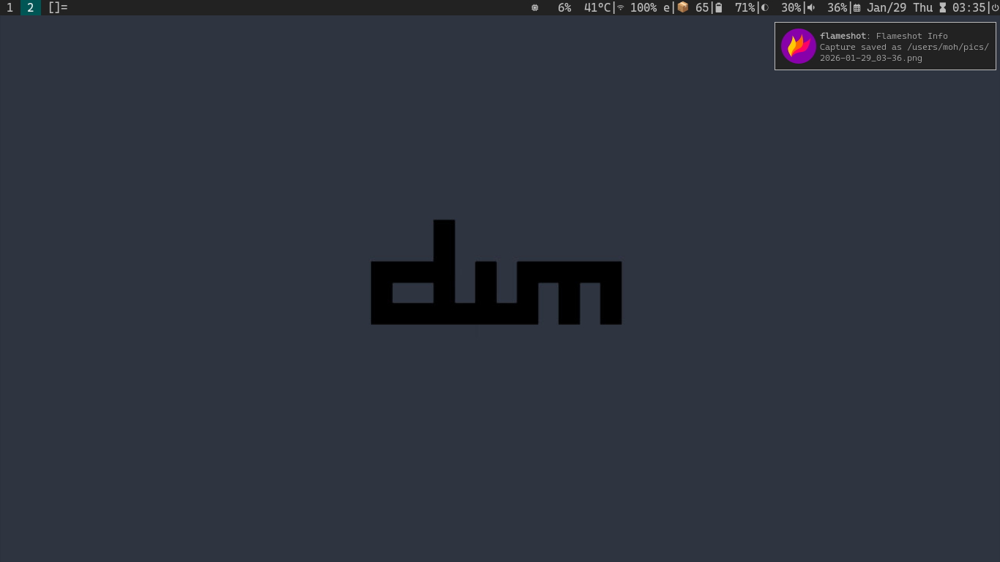

# dwm-6.6 build

## INSTALATION
1. make sure xorg-xinit and dmenu are installed.
2. append "exec startx dwm" (without double quotes) at end of your .bash_profile file.
3. `git clone https://github.com/jysr0/dwm && cd dwm`
4. `sudo make clean install && reboot`
5. `win + r` to run a program, `win + shift + q` to quit dwm.
#### dwmblocks-async
Install and configure [dwmblocks-async](https://github.com/UtkarshVerma/dwmblocks-async) with some scripts, and that's it.
If some issues happen with the clicking see [issues](https://github.com/UtkarshVerma/dwmblocks-async/issues).
## KEY BINDS
Look for config.def.h's keys array.
## PATCHES
[vanitygaps](https://dwm.suckless.org/patches/vanitygaps/), the one that includes most layouts.   
[alpha](https://dwm.suckless.org/patches/alpha/), the "fixborders" one.   
[hide vacant tags](https://dwm.suckless.org/patches/hide_vacant_tags/).   
[pertag](https://dwm.suckless.org/patches/pertag/).   
[attachdirection](https://dwm.suckless.org/patches/attachdirection/).   
[push](https://dwm.suckless.org/patches/push/), the "no master" one.   
[switchcol](https://dwm.suckless.org/patches/switchcol/).   
[decoration hints](https://dwm.suckless.org/patches/decoration_hints/).   
[moveresize](https://dwm.suckless.org/patches/moveresize/).   
[statuscmd](https://dwm.suckless.org/patches/statuscmd/), "with signals" one.   
[zoomswap](https://dwm.suckless.org/patches/zoomswap/).   
[bulkill](https://dwm.suckless.org/patches/bulkill/), the "safe" one.   
[tiledmove](https://dwm.suckless.org/patches/tiledmove/).   
[togglefloatingcenter](https://dwm.suckless.org/patches/togglefloatingcenter/).   
[shift tools](https://dwm.suckless.org/patches/shift-tools/), the "scratchpads" one.   
[alwayscenter](https://dwm.suckless.org/patches/alwayscenter/).   
[allowkillrule](https://dwm.suckless.org/patches/allowkillrule/).   
[inplacerotate](https://dwm.suckless.org/patches/inplacerotate/).   
[center](https://dwm.suckless.org/patches/center/).   
[sticky](https://dwm.suckless.org/patches/sticky/).   
[scratchpads](https://dwm.suckless.org/patches/scratchpads/).   
[cursorwarp](https://dwm.suckless.org/patches/cursorwarp/).   
[colorschemes](https://dwm.suckless.org/patches/colorschemes/).   
## LAYOUT PATCHES
[nrowgrid](https://dwm.suckless.org/patches/nrowgrid/).   
[gaplessgrid](https://dwm.suckless.org/patches/gaplessgrid/).   
[fibonacci](https://dwm.suckless.org/patches/fibonacci/).   
[deck](https://dwm.suckless.org/patches/deck/).   
[bottomstack](https://dwm.suckless.org/patches/bottomstack/).   
[centeredmaster](https://dwm.suckless.org/patches/centeredmaster/).
